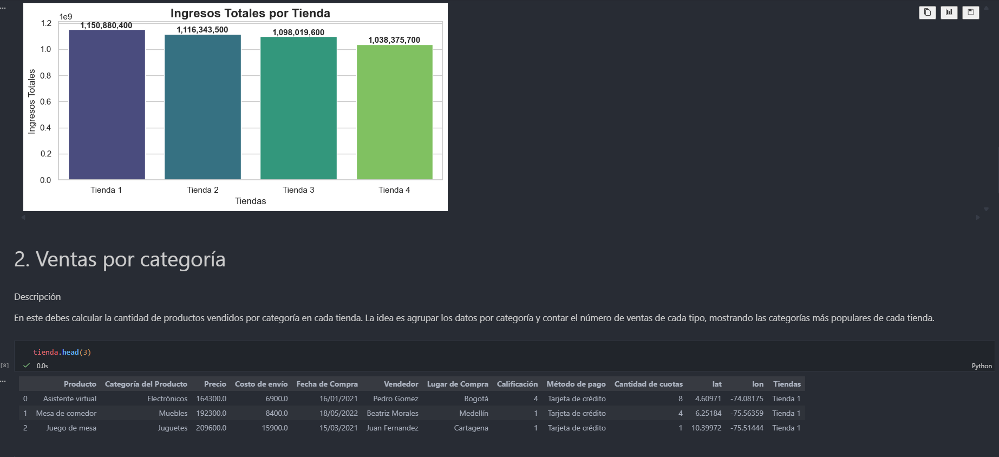

# -challenge1-data-science-alura-store-latam

## Descripcion del Proyecto

Este proyecto realiza un analsis completo de datos de ventas de 4 tiendas diferentes, combinando multiples fuentes de datos para extraer insights comerciales e identificar patrones de ventas, compara rendimiento entre tiendas.

Requisitos:
Dependencias Principales

==================================================
📊 VERSIONES INSTALADAS
==================================================
✅ Python: 3.12.1 (tags/v3.12.1:2305ca5, Dec  7 2023, 22:03:25) [MSC v.1937 64 bit (AMD64)]
✅ Pandas: 2.3.3
✅ Matplotlib: 3.10.3
✅ NumPy: 1.26.4
✅ Seaborn: 0.13.2
✅ IPython (Jupyter): 9.2.0
✅ Google Colab: Disponible
   Entorno: Colab
==================================================


### Esquema del DataFrame Consolidado

```python
<class 'pandas.core.frame.DataFrame'>
RangeIndex: 9435 entries, 0 to 9434
Data columns (total 13 columns):
 #   Column                  Non-Null Count  Dtype  
---  ------                  --------------  -----  
 0   Producto                9435 non-null   object 
 1   Categoría del Producto  9435 non-null   object 
 2   Precio                  9435 non-null   float64
 3   Costo de envío          9435 non-null   float64
 4   Fecha de Compra         9435 non-null   object 
 5   Vendedor                9435 non-null   object 
 6   Lugar de Compra         9435 non-null   object 
 7   Calificación            9435 non-null   int64  
 8   Método de pago          9435 non-null   object 
 9   Cantidad de cuotas      9435 non-null   int64  
 10  lat                     9435 non-null   float64
 11  lon                     9435 non-null   float64
 12  Tiendas                 9435 non-null   object 
dtypes: float64(4), int64(2), object(7)
memory usage: 958.4+ KB

## Analisis

# KPIs calculados
todas_las_tiendas["Cantidad"] = 1

metricas = {
    # Ventas Basicas
    'ventas_totales': todas_las_tiendas.groupby('Tiendas')['Precio'].sum(),
    'numero_transacciones': todas_las_tiendas.groupby('Tiendas').size(),
    
    # Metricas de Precio
    'precio_promedio': todas_las_tiendas.groupby('Tiendas')['Precio'].mean().round(),
    'precio_mediano': todas_las_tiendas.groupby('Tiendas')['Precio'].median(),
    'precio_maximo': todas_las_tiendas.groupby('Tiendas')['Precio'].max(),
    'precio_minimo': todas_las_tiendas.groupby('Tiendas')['Precio'].min(),
    
    # Logistica
    'costo_envio_total': todas_las_tiendas.groupby('Tiendas')['Costo de envío'].sum(),
    'costo_envio_promedio': todas_las_tiendas.groupby('Tiendas')['Costo de envío'].mean().round(),
    
    # Metodo de pago     
    'metodo_pago_preferido': todas_las_tiendas.groupby('Tiendas')['Método de pago'].apply(
    lambda x: x.mode().iloc[0] if not x.mode().empty else 'Sin Datos'),
    
    # Producto Preferido
    'categoria_preferida': todas_las_tiendas.groupby('Tiendas')['Categoría del Producto'].apply(lambda x: x.mode().iloc[0] if not x.mode().empty else 'Sin Datos'),
    
    # Categoria mas Vendida
    'producto_top': todas_las_tiendas.groupby('Tiendas')['Producto'].apply(lambda x: x.mode()[0] if not x.mode().empty else 'Sin datos'),
    
    # Calificacion Promedio
    'calificacion_promedio': todas_las_tiendas.groupby('Tiendas')['Calificación'].mean().round(2)
    
}

df_kapis = pd.DataFrame(metricas)
df_kapis


# Grafica Ingresos Totales

# Configurar el estilo de seaborn
sns.set(style="whitegrid")

# Crear el gráfico de barras
plt.figure(figsize=(10, 6))
barplot = sns.barplot(
    data=df_ingresos_totales,
    x="Tiendas", 
    y="Promedio",
    palette="viridis"
)

# Personalizar el gráfico
plt.title("Ingresos Totales por Tienda", fontsize=16, fontweight='bold')
plt.xlabel("Tiendas", fontsize=12)
plt.ylabel("Ingresos Totales", fontsize=12)

# Añadir los valores encima de cada barra
for bar in barplot.patches:
    barplot.annotate(
        f'{bar.get_height():,.0f}',
        (bar.get_x() + bar.get_width() / 2, bar.get_height()),
        ha='center', va='bottom',
        fontsize=11, fontweight='bold'
    )

# Ajustar layout
plt.tight_layout()

# Mostrar el gráfico
plt.show()




###Contribución

¡Las contribuciones son bienvenidas! Sigue estos pasos:

    Fork el proyecto

    Crea una rama para tu feature (git checkout -b feature/AmazingFeature)

    Commit tus cambios (git commit -m 'Add some AmazingFeature')

    Push a la rama (git push origin feature/AmazingFeature)

    Abre un Pull Request

📄 Licencia

Distribuido bajo la licencia MIT. Ver LICENSE para más información.
https://github.com/LejImkoaj/challenge1-data-science-alura-store-latam

Daniel - @LejImkoaj - dani05sm@gmail.com

Enlace del proyecto: https://github.com/LejImkoaj/challenge1-data-science-alura-store-latam